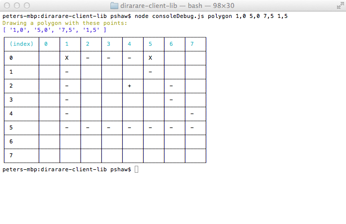

Dirarare Client Lib
===============
a node.js module for animated 2D-Pixel Art

This library draws, fills, move and resize 2D-Pixel art to a grid like a LED-Matrix. 

Tests
-------
run 

```bash
npm test
```

ConsoleDebugger
-----------------------
 

eg: 

```bash
node consoleDebug.js polygon 1,0 5,0 7,5 1,5
```
or

```bash
node consoleDebug.js line 1,0 5,0
```

Still unsupported 
----------------------
- --Movement--
- Resizing
- Dimming (Light effekts)

Contribution
-----------------
Yes, please! If you want to help, feel free! I am glad about every pull request.
